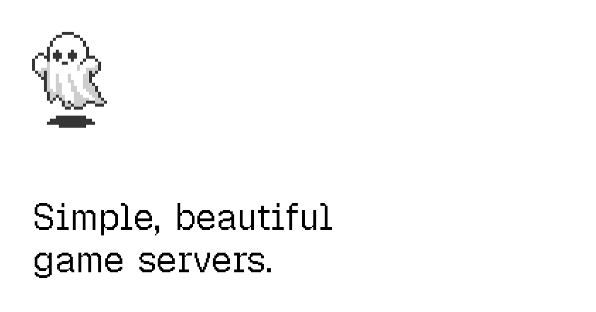

# Ghost



Simple, beautiful game servers. Ghost is a dedicated game server platform you deploy yourself — your Vercel account, your Hetzner account, your billing, your data. Spin one up in seconds — Docker, SSH, and firewall rules handled for you.

## Deploy your own

[](https://vercel.com/new/clone?repository-url=https%3A%2F%2Fgithub.com%2Fhaydenbleasel%2Fghost&project-name=ghost&repository-name=ghost&env=HETZNER_API_TOKEN,AUTH_PASSWORD,GHOST_SECRET&envDescription=Hetzner%20Cloud%20API%20token%2C%20dashboard%20password%2C%20and%20a%20random%20signing%20secret&envLink=https%3A%2F%2Fgithub.com%2Fhaydenbleasel%2Fghost%23environment-variables&stores=%5B%7B%22type%22%3A%22postgres%22%7D%2C%7B%22type%22%3A%22kv%22%7D%2C%7B%22type%22%3A%22blob%22%7D%5D)

The Deploy Button clones this repo to your GitHub account, creates a Vercel project connected to it, provisions the backing stores (Neon Postgres, Upstash Redis, Vercel Blob — their connection strings are injected automatically), and prompts you for the three secrets below.

1. **Create a Hetzner Cloud project** and generate an API token (Read & Write) — [how to create a token](https://docs.hetzner.cloud/#getting-started). All VMs run in your Hetzner project and are billed to you.
2. **Click the button** and fill in the env vars (see [Environment variables](#environment-variables)).
3. **Sign in** at your deployment's URL with `AUTH_PASSWORD` (email defaults to `admin@ghost.local` unless you set `AUTH_EMAIL`).
4. **Bake your golden image** — open `/dashboard/account` and click **Build snapshot**. Baking takes ~10–15 min. Once it's ready, you can create servers.

> [!NOTE]
> New Hetzner Cloud accounts are capped at 5 servers per project until the account is verified. Provisioning fails with `resource_limit_exceeded` once you hit it — request a limit increase from Hetzner support.

### Environment variables

Generate `GHOST_SECRET` with `openssl rand -hex 32`.

| Variable                | Purpose                                                                                                                       |
| ----------------------- | ----------------------------------------------------------------------------------------------------------------------------- |
| `HETZNER_API_TOKEN`     | Hetzner Cloud API token (Read & Write). Every provisioning call runs against your project.                                    |
| `AUTH_PASSWORD`         | Dashboard sign-in password (8+ chars). There is no sign-up — this deployment is yours alone.                                  |
| `GHOST_SECRET`          | Signs the session cookie, agent bootstrap JWTs, and snapshot download tokens (32+ chars). Rotating it signs out all sessions. |
| `AUTH_EMAIL` (optional) | Sign-in email. Defaults to `admin@ghost.local`; changing it also signs out existing sessions.                                 |

`DATABASE_URL`, `DATABASE_URL_UNPOOLED`, `KV_REST_API_URL`, `KV_REST_API_TOKEN`, and `BLOB_READ_WRITE_TOKEN` are injected by the store integrations — nothing else to configure.

### Preview deployments

If you use Vercel preview deployments, enable **Deployment Protection → Protection Bypass for Automation** in your project settings. The generated value is auto-injected as `VERCEL_AUTOMATION_BYPASS_SECRET` so Hetzner agents can punch through the auth wall on callbacks. Production deployments don't need it. Snapshots are scoped per environment, so a preview's golden image never clobbers production's.

## Layout

```
app/                  Next.js App Router — UI, API, env-credential auth
lib/                  server-side libs (db, redis, hetzner, agent helpers, workflows)
protocol/             Zod schemas + signing canonicalization shared with the agent
agent/                Bun-built TypeScript agent (compiled to a Linux binary)
prisma/               schema + migrations
games/                per-game compose generators
```

## Local development

```bash
git clone https://github.com/<you>/ghost.git && cd ghost
bun install
cp .env.example .env.local   # fill in the values
bun migrate
bun dev
```

You'll need your own Postgres/Redis/Blob values in `.env.local` (the same ones your Vercel deployment uses, or separate dev instances).

### Adding a new game

Each game lives in its own folder under `games/`. To add one:

1. **Create a folder** — `games/<your-game>/` with three files:
   - `install.ts` — exports `dockerImage` (the upstream image tag) and `build<Game>Compose(config, settings)` (returns the compose YAML string).
   - `settings.ts` — exports a settings schema via `defineSettings(...)` describing the per-server options.
   - `index.ts` — exports the game definition (`id`, `name`, `description`, `image`, `dockerImage`, `ports`, `requirements`, `settings`, `buildCompose`, etc.). Use an existing folder like `games/minecraft/` as a template.

2. **Register it in `games/index.ts`** — import your game and add it to the `games` array.

3. **Redeploy and rebuild the snapshot** — the snapshot's `docker pull` list is derived from `games[].dockerImage`, so once you redeploy, click **Build snapshot** again to bake the new image into the golden image.

## Scripts

- `bun dev` — Next dev server (turbopack)
- `bun run build` — prisma migrate + generate + next build
