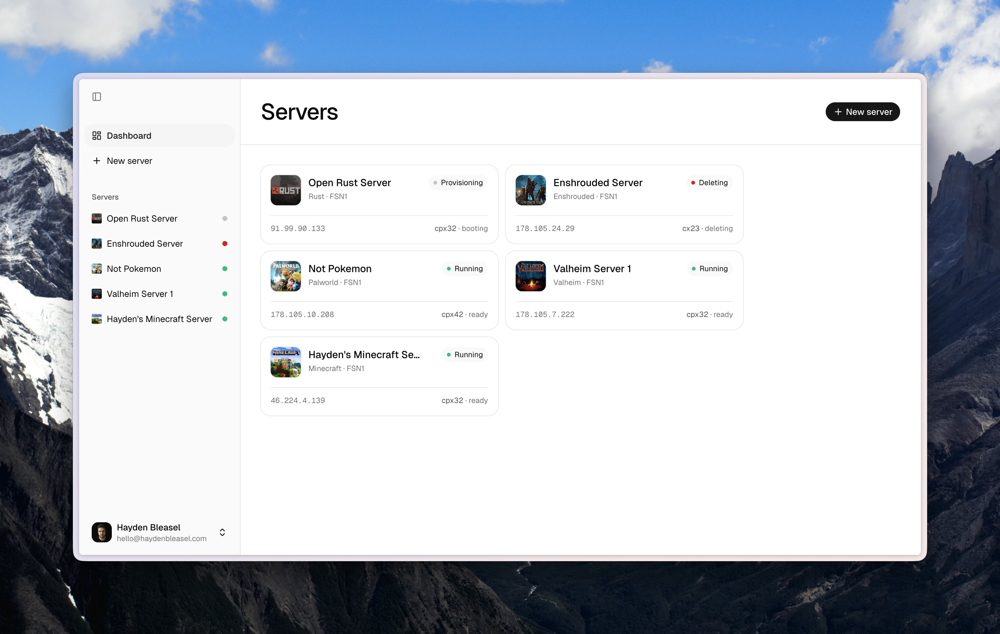
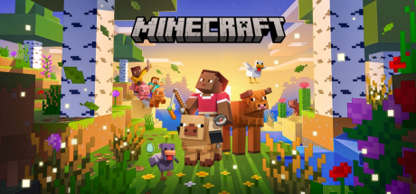
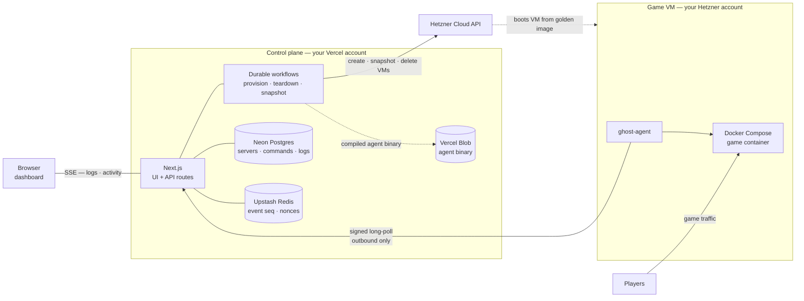

<p align="center">
  
</p>

<h1 align="center">
  Ghost
  <br />
  <sub><sup>Simple, beautiful game servers in under a minute.</sup></sub>
</h1>

Pick a game, pick a region, click start. Drop the IP in your group chat — no terminals, no toggles, no surprises. Ghost is an open-source dedicated game server platform you deploy yourself: your Vercel account, your Hetzner account, your billing, your data. Docker, SSH, and firewall rules are handled for you.

- **Open source, end to end** — the whole stack lives on GitHub. Read it, fork it, self-host it; there's no black box.
- **Up in seconds** — a dedicated server in under a minute, booted from a pre-baked golden image.
- **Beautiful by default** — a dashboard you'll actually want to look at. Sensible defaults instead of a hundred toggles.
- **Live console** — stream stdout straight from the container and run commands without leaving the page.
- **Honest activity log** — every start, stop, restart, and config change in a clean, filterable timeline.
- **Your infra, your rules** — bring your own Hetzner key. Your infrastructure, your billing, your data — Ghost just wires it up.



## Deploy your own

[](https://vercel.com/new/clone?repository-url=https%3A%2F%2Fgithub.com%2Fhaydenbleasel%2Fghost&project-name=ghost&repository-name=ghost&env=HETZNER_API_TOKEN,AUTH_PASSWORD,GHOST_SECRET&envDescription=Hetzner%20Cloud%20API%20token%2C%20dashboard%20password%2C%20and%20a%20random%20signing%20secret&envLink=https%3A%2F%2Fgithub.com%2Fhaydenbleasel%2Fghost%23environment-variables&stores=%5B%7B%22type%22%3A%22postgres%22%7D%2C%7B%22type%22%3A%22kv%22%7D%2C%7B%22type%22%3A%22blob%22%7D%5D)

The Deploy Button clones this repo to your GitHub account, creates a Vercel project connected to it, provisions the backing stores (Neon Postgres, Upstash Redis, Vercel Blob — their connection strings are injected automatically), and prompts you for the three secrets below.

1. **Create a Hetzner Cloud project** and generate an API token (Read & Write) — [how to create a token](https://docs.hetzner.cloud/#getting-started). All VMs run in your Hetzner project and are billed to you.
2. **Click the button** and fill in the env vars (see [Environment variables](#environment-variables)).
3. **Sign in** at your deployment's URL with `AUTH_PASSWORD` (email defaults to `admin@ghost.local` unless you set `AUTH_EMAIL`).
4. **Bake your golden image** — open `/account` and click **Build snapshot**. Baking takes ~10–15 min. Once it's ready, you can create servers.

> [!NOTE]
> New Hetzner Cloud accounts are capped at 5 servers per project until the account is verified. Provisioning fails with `resource_limit_exceeded` once you hit it — request a limit increase from Hetzner support.

### Environment variables

Generate `GHOST_SECRET` with `openssl rand -hex 32`.

| Variable | Purpose |
| --- | --- |
| `HETZNER_API_TOKEN` | Hetzner Cloud API token (Read & Write). Every provisioning call runs against your project. |
| `AUTH_PASSWORD` | Dashboard sign-in password (8+ chars). There is no sign-up — this deployment is yours alone. |
| `GHOST_SECRET` | Signs the session cookie, agent bootstrap JWTs, and snapshot download tokens (32+ chars). Rotating it signs out all sessions. |
| `AUTH_EMAIL` (optional) | Sign-in email. Defaults to `admin@ghost.local`; changing it also signs out existing sessions. |

`DATABASE_URL`, `DATABASE_URL_UNPOOLED`, `KV_REST_API_URL`, `KV_REST_API_TOKEN`, and `BLOB_READ_WRITE_TOKEN` are injected by the store integrations — nothing else to configure.

### Preview deployments

If you use Vercel preview deployments, enable **Deployment Protection → Protection Bypass for Automation** in your project settings. The generated value is auto-injected as `VERCEL_AUTOMATION_BYPASS_SECRET` so Hetzner agents can punch through the auth wall on callbacks. Production deployments don't need it. Snapshots are scoped per environment, so a preview's golden image never clobbers production's.

### Keeping your instance updated

The Deploy Button creates a copy of this repo under your account — it doesn't track upstream automatically. To pull in new games and fixes:

1. On your repo's GitHub page, click **Sync fork** (or merge `haydenbleasel/ghost` manually).
2. Vercel deploys the update automatically; database migrations run as part of the build.
3. If the update added or changed games, open `/account` and click **Build snapshot** so the new images get baked into your golden image.

## Supported games

Every supported game lives behind the same one-click flow. Your VM, your token, your billing.

<table>
  <tr>
    <td width="50%">
      <br/>
      <b>Minecraft</b><br/>
      <sub>Minecraft is a sandbox game where you can build your own world.</sub>
    </td>
    <td width="50%">
      <br/>
      <b>Rust</b><br/>
      <sub>The only aim in Rust is to survive when everything on the island wants you to die.</sub>
    </td>
  </tr>
  <tr>
    <td width="50%">
      <br/>
      <b>Valheim</b><br/>
      <sub>A Viking-themed action RPG where you explore, craft, build, and survive.</sub>
    </td>
    <td width="50%">
      <br/>
      <b>Palworld</b><br/>
      <sub>Fight, farm, build and work alongside mysterious creatures called "Pals".</sub>
    </td>
  </tr>
  <tr>
    <td width="50%">
      <br/>
      <b>Counter-Strike 2</b><br/>
      <sub>The legendary tactical FPS. Plant the bomb, defuse it, or just frag your friends.</sub>
    </td>
    <td width="50%">
      <br/>
      <b>Left 4 Dead 2</b><br/>
      <sub>Co-op zombie apocalypse FPS. Fight your way through hordes of the infected with up to 3 friends.</sub>
    </td>
  </tr>
  <tr>
    <td width="50%">
      <br/>
      <b>Terraria</b><br/>
      <sub>Dig, fight, explore, build! Nothing is impossible in this 2D adventure game.</sub>
    </td>
    <td width="50%">
      <br/>
      <b>Satisfactory</b><br/>
      <sub>Construct factories, automate production, and explore an alien planet with friends.</sub>
    </td>
  </tr>
  <tr>
    <td width="50%">
      <br/>
      <b>Enshrouded</b><br/>
      <sub>A game of survival, crafting, and action on a sprawling voxel-based continent.</sub>
    </td>
    <td width="50%">
      <br/>
      <b>Don't Starve Together</b><br/>
      <sub>A multiplayer survival sandbox where you brave hunger, monsters, and madness with friends.</sub>
    </td>
  </tr>
  <tr>
    <td width="50%">
      <br/>
      <b>V Rising</b><br/>
      <sub>Rise as a vampire lord — hunt, build a castle, and battle players in a gothic open world.</sub>
    </td>
    <td width="50%">
      <br/>
      <b>Factorio</b><br/>
      <sub>Build and grow a factory on an alien planet. Co-op automation sandbox.</sub>
    </td>
  </tr>
  <tr>
    <td width="50%">
      <b><a href="https://github.com/haydenbleasel/ghost/issues/new">Don't see yours?</a></b><br/>
      <sub>Open an issue on GitHub and we'll add it to the roadmap — or add it yourself with a game folder and a snapshot rebuild (see below).</sub>
    </td>
  </tr>
</table>

## How it works

Ghost is a control plane on Vercel that orchestrates Docker game servers on your own Hetzner Cloud account. The system has two halves: the control plane runs on Vercel and holds all coordination state; the runtime — the game container itself — runs on a Hetzner VM you own. The two communicate over a signed long-poll channel that the agent always initiates outbound, so VMs never expose a management port.



| Layer | Role |
| --- | --- |
| Next.js on Vercel | Dashboard, API routes, and server actions. Coordination state only; game state lives on the VMs. |
| Workflow SDK (durable steps) | Provisioning, teardown, and snapshot builds run as durable workflows. Each step emits a structured activity event that the UI streams over SSE. |
| Neon Postgres (Prisma) | Server records, agent registrations, command queue, activity log, and ring-buffered console logs. |
| Upstash Redis | Monotonic event sequence per server plus a short-TTL nonce cache for replay protection on signed agent requests. |
| Hetzner Cloud VMs | Each game server is a VM booted from your prebaked snapshot — Docker, the agent, and every game image are already on disk. |
| ghost-agent (on each VM) | A single Bun-compiled Linux binary that supervises one Docker Compose project per VM. It long-polls for commands and never accepts inbound connections. |

### Provisioning

Provisioning is a durable workflow, not a single request — each step is idempotent and resumable, so a dropped connection can't abandon a half-provisioned server.

1. **Server action** — `createServer` kicks off the `provisionServer` workflow and writes a row with `desiredState=running`.
2. **Bootstrap token** — a short-lived JWT is minted, scoped to a single server. Cloud-init writes it to `/etc/ghost/bootstrap.json` on first boot.
3. **Hetzner create** — a VM is created from your golden snapshot; the workflow polls until it's running.
4. **Agent enroll** — on boot, ghost-agent exchanges the bootstrap JWT for a persistent Ed25519 key registration via `POST /api/agent/enroll`.
5. **Push compose** — an `UPDATE_CONFIG` command is enqueued with the rendered `docker-compose.yml`. The agent picks it up within ~1s and runs `docker compose up`.
6. **Healthy → ready** — the workflow waits for the container to report healthy, then marks the server ready. The dashboard streams activity events throughout.

Start, stop, and restart follow the same pattern: a row is added to the command queue, the agent picks it up on its next long-poll, executes the Docker command, and acks. Delete flips `desiredState=deleted` and starts the `teardownServer` workflow.

### Agent protocol

The ghost-agent is the only process on a game VM that talks to Ghost, and it only opens connections outward — the VM's public ports are limited to the game's own.

- **Enrollment** — `POST /api/agent/enroll` exchanges the one-shot bootstrap JWT for a persistent Ed25519 public key registration. After that, the JWT is dead.
- **Signing** — every request carries `X-Ghost-Agent`, `X-Ghost-Ts`, `X-Ghost-Nonce`, and `X-Ghost-Sig`: an `ed25519(method || path || ts || nonce || body)` signature over a canonicalized body shared with the server via the `protocol/` package.
- **Replay protection** — 60s timestamp skew tolerance; nonces live in Redis with a 5-minute TTL.
- **Long-poll for commands** — `GET /api/agent/commands?wait=25` hangs for up to 25 seconds and returns the next batch of commands or a 204. This is the path that turns a UI action into a Docker command on the VM.
- **Events, logs, heartbeat** — the agent batches activity events and console output, POSTs them up, and heartbeats every ~30s. The dashboard fans these back out over SSE with a cursor on the monotonic sequence, so reconnecting clients resume where they left off.

### The golden image

New servers are ready in roughly 60 seconds because almost nothing happens on first boot: Docker, the ghost-agent binary, the UFW baseline, and every supported game's container image are already on disk. That pre-baked disk is the golden image — a Hetzner snapshot in your account, scoped per deployment environment, built from the dashboard:

1. **Compile the agent** — a Vercel Sandbox at the current commit runs `bun run agent:build` and uploads the binary to Vercel Blob (private), minting a short-lived download token.
2. **Spin up a builder VM** — cloud-init curls the binary, installs Docker and a UFW baseline, pre-pulls every game's image, and runs `shutdown -h now`.
3. **Snapshot and swap** — once the VM is off, the workflow snapshots it, polls until the image is available, records the new ID, then deletes both the builder VM and the previous snapshot, so only one snapshot is billed at a time.

The whole run takes ~10–15 minutes and can be watched live from `/account`. Concurrent builds are serialized with a Postgres advisory lock. The builder VM is throwaway by design: Hetzner can only snapshot a real VM, so the builder exists solely to pull everything onto disk and shut itself down.

## Layout

```
app/                  Next.js App Router — UI, API, env-credential auth
lib/                  server-side libs (db, redis, hetzner, agent helpers, workflows)
protocol/             Zod schemas + signing canonicalization shared with the agent
agent/                Bun-built TypeScript agent (compiled to a Linux binary)
prisma/               schema + migrations
games/                per-game compose generators
```

## Local development

```bash
git clone https://github.com/<you>/ghost.git && cd ghost
bun install
cp .env.example .env.local   # fill in the values
bun migrate
bun dev
```

You'll need your own Postgres/Redis/Blob values in `.env.local` (the same ones your Vercel deployment uses, or separate dev instances).

### Adding a new game

Each game lives in its own folder under `games/`. To add one:

1. **Create a folder** — `games/<your-game>/` with three files:
   - `install.ts` — exports `dockerImage` (the upstream image tag) and `build<Game>Compose(config, settings)` (returns the compose YAML string).
   - `settings.ts` — exports a settings schema via `defineSettings(...)` describing the per-server options.
   - `index.ts` — exports the game definition (`id`, `name`, `description`, `image`, `dockerImage`, `ports`, `requirements`, `settings`, `buildCompose`, etc.). Use an existing folder like `games/minecraft/` as a template.

2. **Register it in `games/index.ts`** — import your game and add it to the `games` array.

3. **Redeploy and rebuild the snapshot** — the snapshot's `docker pull` list is derived from `games[].dockerImage`, so once you redeploy, click **Build snapshot** again to bake the new image into the golden image.

## Scripts

- `bun dev` — Next dev server (turbopack)
- `bun run build` — prisma migrate + generate + next build
